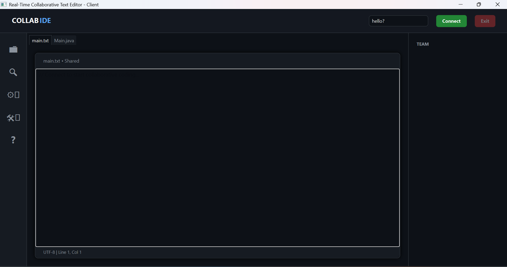
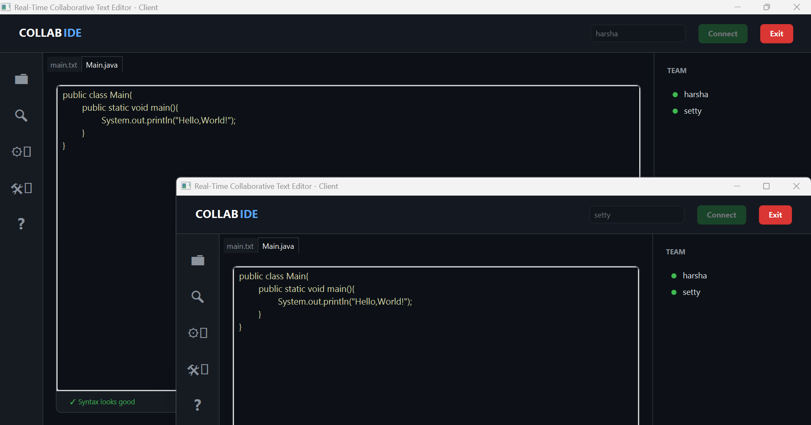
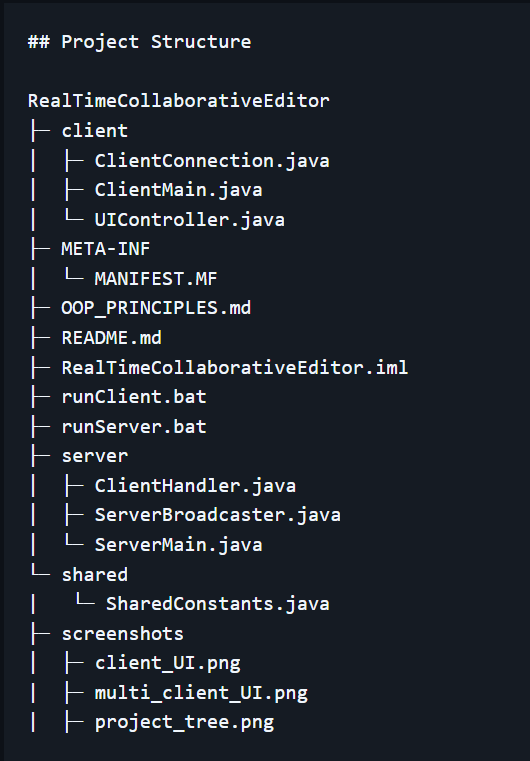

## Real-Time Collaborative Editor

A Real-Time Collaborative Text Editor built using JavaFX, WebSockets, and Java Input/Output Streams. This application allows multiple users to collaboratively edit text files in real time with instant synchronization across all connected clients.

---

## Overview

The Real-Time Collaborative Editor follows a client–server architecture where multiple clients connect to a centralized server. Any text modification made by one user is immediately transmitted to the server and broadcast to all other connected clients, ensuring consistency and real-time collaboration.

The application provides an IDE-like interface developed using JavaFX and supports multiple file types such as `.txt` and `.java`.

---

## Features

- Real-time collaborative text editing
- Multiple client support
- Instant synchronization of text changes
- Client–server architecture
- JavaFX-based desktop user interface
- WebSocket communication for low-latency updates
- Java Input/Output Streams for data transfer
- Live user presence tracking
- Graceful client connection and disconnection handling
- Syntax validation feedback

---

## Tech Stack

- Java
- JavaFX
- WebSockets
- Java Input/Output Streams
- Socket Programming
- Multithreading
- Object-Oriented Programming (OOP)

---

## System Architecture

The system is divided into three main modules:

1. Client  
   Handles user interaction, text editing, and communication with the server.

2. Server  
   Manages multiple client connections and broadcasts text updates.

3. Shared  
   Contains constants and common configurations used by both client and server.

---
```
## Project Structure

RealTimeCollaborativeEditor
├─ client
│  ├─ ClientConnection.java
│  ├─ ClientMain.java
│  └─ UIController.java
├─ META-INF
│  └─ MANIFEST.MF
├─ OOP_PRINCIPLES.md
├─ README.md
├─ RealTimeCollaborativeEditor.iml
├─ runClient.bat
├─ runServer.bat
├─ server
│  ├─ ClientHandler.java
│  ├─ ServerBroadcaster.java
│  └─ ServerMain.java
└─ shared
|   └─ SharedConstants.java
├─ screenshots
│  ├─ client_UI.png
|  ├─ multi_client_UI.png
|  ├─ project_tree.png
```
---
## How It Works

1. The server is started and listens for incoming client connections.
2. Each client connects to the server using a unique username.
3. When a user edits the text:
   - The change is sent to the server through WebSocket communication.
   - The server broadcasts the update to all connected clients.
4. All clients update their editor content in real time.

---

## How to Run

### Prerequisites
- Java Development Kit (JDK 8 or higher)
- JavaFX properly configured in your IDE or included via VM options
- All clients must be connected to the same local network (LAN)

### Start the Server
- Execute the `runServer.bat` file to start the collaboration server.
- The server listens for incoming client connections and manages real-time synchronization.

### Start the Client
- Execute the `runClient.bat` file to launch a client instance.
- Each execution creates a new client connected to the server.
- Multiple clients can be launched on the same LAN to test real-time collaboration.

### Additional Notes
- JavaFX must be configured correctly in the IDE using the required VM options.
- Additional clients can also be launched by executing the packaged JAR file.
- Ensure the server is running before starting any client instances.

---

## Learning Outcomes

- Understanding of real-time collaborative systems
- Hands-on experience with WebSockets and stream-based communication
- Implementation of multithreaded server applications
- Practical application of Object-Oriented Programming principles
- JavaFX desktop application development

---

## Future Enhancements

- User authentication and authorization
- Version control and edit history
- Conflict resolution using Operational Transformation or CRDT
- Syntax highlighting for multiple programming languages
- Cloud-based deployment

---

## Screenshots

### Client User Interface


### Multiple Clients Collaborating in Real Time


### Project Structure


## Author

`Harshith Kumar B K (For College)`
`Contact - kumarsetty1212@gmail.com`
`Aspiring Software Development Engineer and AI/ML Engineer`
